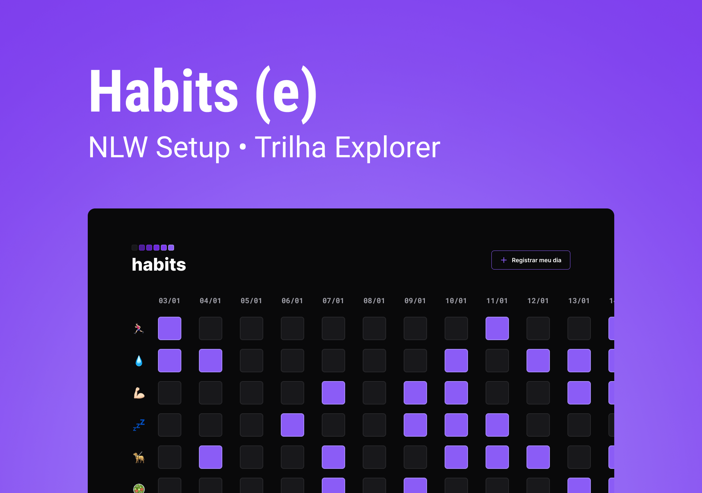

<h1 align="center"> Habits </h1>

Projeto desenvolvido durante o NLW Setup, promovido pela Rocketseat para ensino de tecnologias WEB.  

 

  

## 🚀 Tecnologias

Esse projeto foi desenvolvido com as seguintes tecnologias:

- HTML e CSS
- JavaScript
- Git e Github
- Figma

## 💻 Projeto

O Habits é um app para ajudar a rastrear os hábitos.

- [Visite o projeto online](https://lucascorreagoldani.github.io/nlw-setup-habits)

---

Feito por Rocketseat e adapdato por Lucas